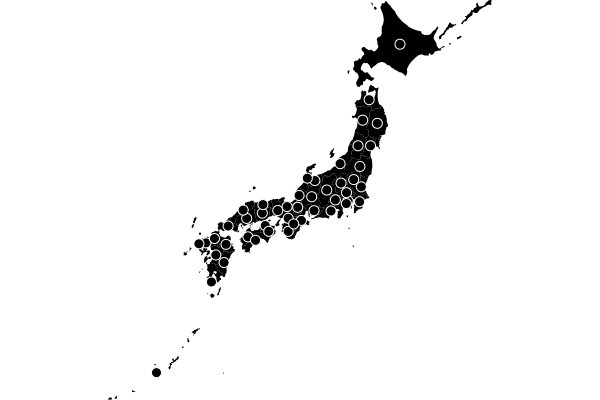
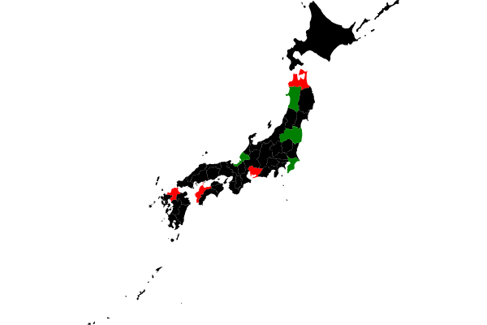
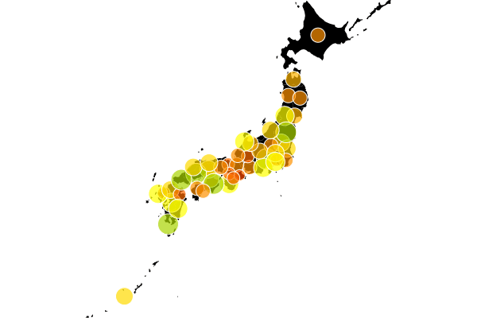
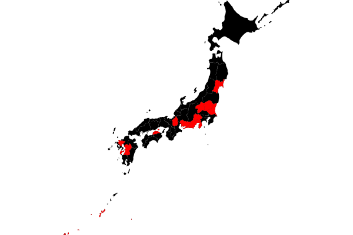
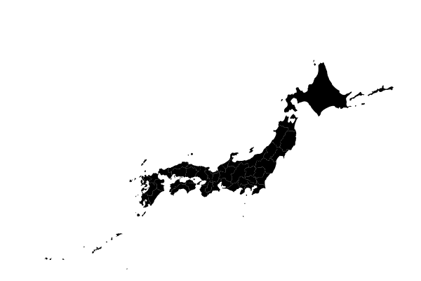
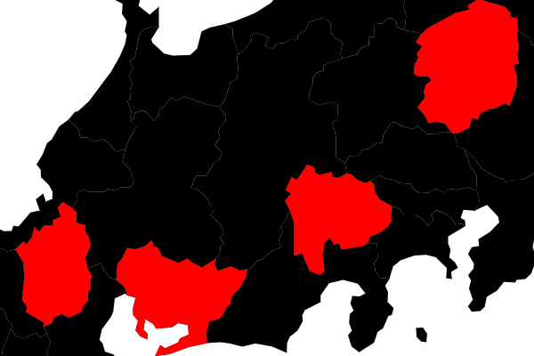

# gramex-cartogram

A layered map visual that renders choropleths and cartograms from TopoJSON files.

## Example

Given this [TopoJSON file of Japan](docs/japan.json), you can render a map like this:

[](docs/japan.html ":include")

[Here is the source code for the map above](docs/japan.html ":include :type=code")

## Installation

Install via `npm`:

```bash
npm install @gramex/cartogram
```

Use locally as an ES module:

```html
<script type="module">
  import { cartogram } from "./node_modules/@gramex/cartogram/index.js";
</script>
```

Use locally as a script:

```html
<script src="./node_modules/@gramex/cartogram/cartogram.min.js"></script>
```

Use via CDN as an ES Module:

```html
<script type="module">
  import { cartogram } from "https://cdn.jsdelivr.net/npm/@gramex/cartogram@1/+esm";
</script>
```

Use via CDN as a script:

```html
<script src="https://cdn.jsdelivr.net/npm/@gramex/cartogram@1/cartogram.min.js"></script>
```

## API

The `cartogram()` function accepts the following parameters:

- `element`: the SVG element to render the map in. This may be an `<svg>` or a `<g>` element.
- `options`: an object with the following keys
  - `layers`: an array of layers. Each layer draws a map. It's an object with these keys:
    - `type`: `"choropleth"` or `"cartogram"`
    - `data`: a [TopoJSON map](https://github.com/topojson/topojson) object
    - `id`: optional ID for the map layer;
    - `filter`: optional function to filter which features are drawn, e.g. `(d) => d.properties.population > 1000000`
    - `update`: optional function to update the map features, e.g. `(join) => join.attr('fill', d => d.color)`
    - `fitSize`: optional boolean. If true, the projection automatically fits to the boundary of this layer
  - `projection`: Any [d3-geo projection](https://github.com/d3/d3-geo)
  - `width`: optional width of the map. Defaults to the element's size (or the nearest SVG parent)
  - `height`: optional width of the map. Defaults to the element's size (or the nearest SVG parent)

## Color features

Add an `update` function to color features based on data.

[](docs/color.html ":include")

[Source code](docs/color.html ":include :type=code")

## Resize features

Add an `update` function to set any attribute on features based on data.

[](docs/features.html ":include")

[Source code](docs/features.html ":include :type=code")

## Filter features

The `filter` function is called with each feature. Features are objects with the following keys:

- `type`: `"Feature"`
- `properties`: An object with the properties of the feature. This varies by map.
- `geometry`: An object with the geometry of the feature. Use [d3-geo](https://github.com/d3/d3-geo) to process this

This example draws 2 layers. The second layer filters selected features and colors it in red.

[](docs/filter.html ":include")

[Source code](docs/filter.html ":include :type=code")

## Add tooltips

This example shows how to use [Bootstrap tooltips](https://getbootstrap.com/docs/5.3/components/tooltips/).

1. Add a `data-bs-toggle="tooltip" title="..."` attribute to each feature using `update`
2. Call `new bootstrap.Tooltip(element, {selector: '[data-bs-toggle="tooltip"]'})` to initialize tooltips

[Example](docs/tooltip.html ":include")

[Source code](docs/tooltip.html ":include :type=code")

## Change projection

This example shows how to pass a [d3-geo projection](https://github.com/d3/d3-geo) as `projection`.

[](docs/projection.html ":include")

[Source code](docs/projection.html ":include :type=code")

## Transform SVG

`cartogram()` works on any `<svg>` or `<g>` element, and respects all transformations.

[](docs/transform.html ":include")

[Source code](docs/transform.html ":include :type=code")

## Fit size

To zoom the map to fit a layer, add `fitSize: true` to the layer.

[](docs/fitsize.html ":include")

[Source code](docs/fitsize.html ":include :type=code")
